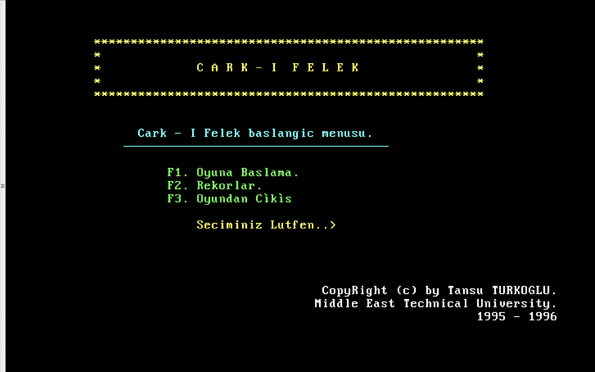
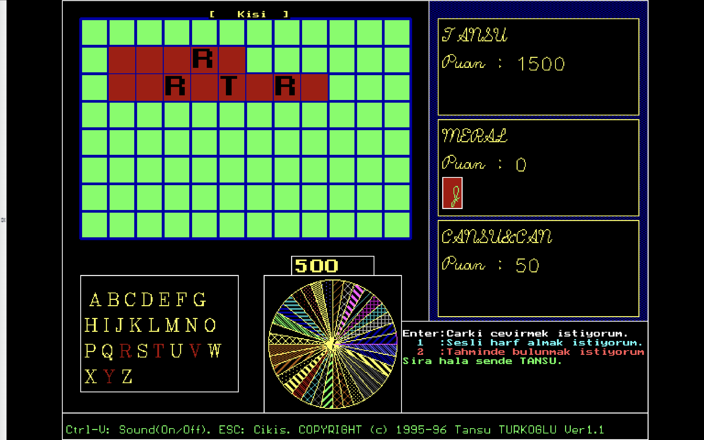

# Çark-ı Felek

This is a famous Turkish game named "Çark-ı Felek" (Wheel of Fortune).

It was developed by Tansu Türkoğlu in 1995 using Borland Pascal.

## Play Online

[Click here to play the game online!](https://tansut.github.io/carki-felek)

## Screenshots

Here are some screenshots from the game:

**Start Screen:**

**In-Game:**

[Also see Pişti!](https://tansut.github.io/carki-felek/pisti.html)